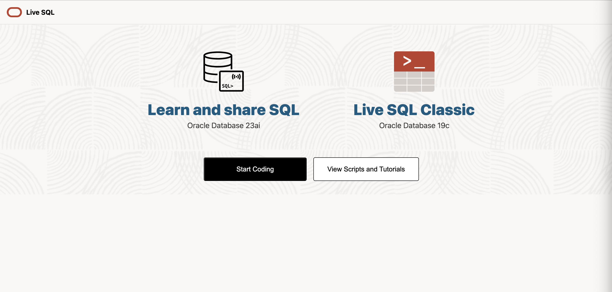

## Oracle Live SQL 사용법

### 1. Oracle Live SQL 접속

Oracle Live SQL 사이트에 접속합니다: https://livesql.oracle.com/landing/

링크에 접속하면 위와 같은 메인 화면을 확인할 수 있습니다.

---

### 2. 데이터 조회 모드 vs 데이터 조작 모드

Oracle Live SQL에서는 두 가지 사용 방식이 있습니다:

**단순 데이터 조회의 경우**
- SELECT문 등을 사용한 데이터 읽기만 수행
- 회원가입/로그인 없이도 사용 가능
- 하지만 향후 인덱스 생성이나 테이블 데이터 조작을 위해 **회원가입을 권장**합니다

**데이터 조작의 경우**  
- INSERT, DELETE, CREATE, DROP 등의 명령어 사용
- 회원가입/로그인이 필요합니다

---

### 3. Worksheet 시작하기

메인 화면에서 **"Start Coding"** 버튼을 클릭하면 SQL Worksheet가 열립니다.

---

### 4. SCOTT 계정으로 데이터 조회하기

#### 4-1. SCOTT 계정 선택
좌측 사이드바의 Navigator에서 **SCOTT** 계정을 선택할 수 있습니다.

#### 4-2. SQL 쿼리 실행
1. SQL Worksheet에 원하는 SQL문을 작성합니다
2. 상단의 **▶️ 실행 버튼**을 클릭합니다
3. 하단에 Query Result가 표시됩니다

---

### 5. 데이터 조작을 위한 환경 설정

#### ⚠️ 주의사항
기본 제공되는 SCOTT 계정은 **READ ONLY** 권한만 가지고 있어 데이터 조작이 불가능합니다.

#### 📝 해결방법
데이터 조작(INSERT, DELETE, CREATE 등)을 위해서는 별도의 SCOTT 환경을 구축해야 합니다.

**단계별 진행 방법:**
1. 새로운 SQL Worksheet를 생성합니다
2. 동일 디렉터리에 있는 `scott.md` 파일의 SQL 실행문을 확인합니다
3. 해당 SQL문들을 **블록 단위로 순차적으로 실행**합니다

#### 설정 완료 확인
SCOTT 환경이 올바르게 생성되면, 좌측 Navigator에 다음과 같이 생성된 객체들이 표시됩니다:

---

### 💡 실습 팁
- SQL 실행 시 한 번에 모든 코드를 실행하지 말고, **블록 단위, 혹은 한줄씩 실행**하세요
- 에러가 발생하면 해당 블록만 다시 실행하여 문제를 해결할 수 있습니다
- Navigator에서 생성된 테이블과 객체들을 확인하며 진행상황을 점검하세요